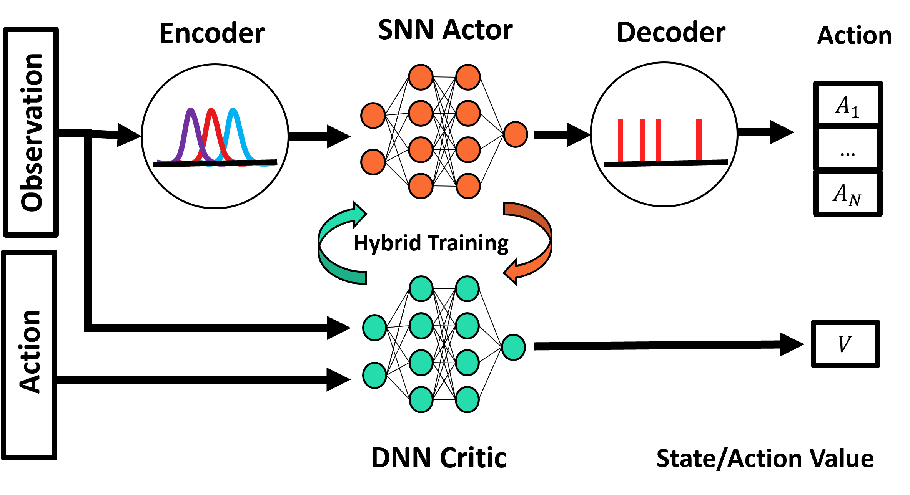
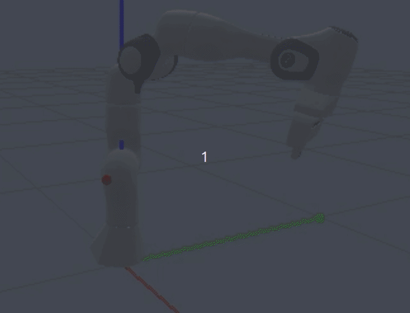

# Joint Space Control (JSC) using a Population Coded Spking Actor Network (PopSAN)

This master thesis investigates the use of a PopSAN Spiking Neural Network (SNN) for learning the inverse kinematics of a 7-DOF robotic arm, leveraging reinforcement learning (RL) techniques. The PopSAN agent is trained in simulation and its performance is compared with a traditional Deep Neural Network (DNN) approach using the Proximal Policy Optimization (PPO) algorithm. 
Both methods were evaluated in simulation and successfully transferred to a real FR3 robot. Therefore, this thesis discusses and demonstrates the potential benefits of SNNs in practical robotic applications.

<div align="center">
 
</div>

## Results

The evaluation showed that the PopSAN agent achieved a success rate of 90% for inverse kinematics tasks, while the Deep Neural Network (DNN) agent reached 99%. 
Although the PopSAN agent performed competitively, it did not fully match the DNN’s performance in certain areas. This study highlights the potential of Spiking Neural Networks (SNNs) to learn complex tasks while retaining their inherent advantages. Given the close performance to the DNN, it is likely that with further hyperparameter tuning, the SNN could achieve results comparable to the DNN agent. For a deeper insight into this work, please refer to the Master’s thesis PDF available in this repository.

<table align="center" style="border-collapse: collapse; border: none;">
  <tr>
    <td align="center" style="border: none;">
      
    </td>
    <td align="center" style="border: none;">
      
    </td>
  </tr>
</table>

## Run the agent

1. Navigate to /conda_envs and execute: ```conda env create -f snn_env.yaml```
2. Activate the conda env: ```conda activate snn_env```
3. Run trained SNN agent ```python evaluate_agents.py eval_snn```


